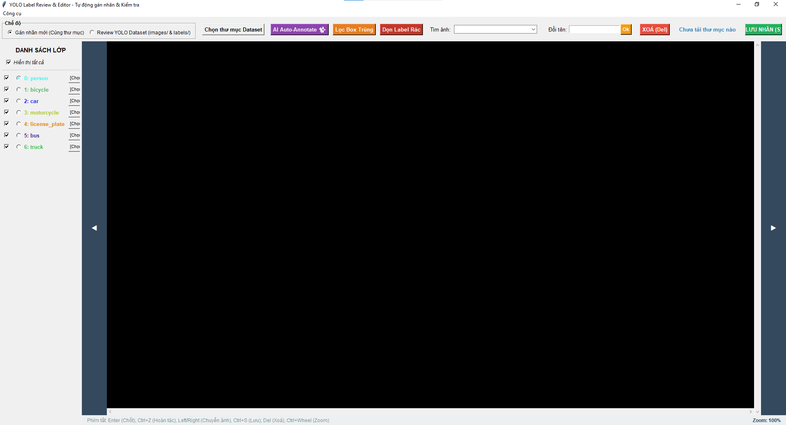
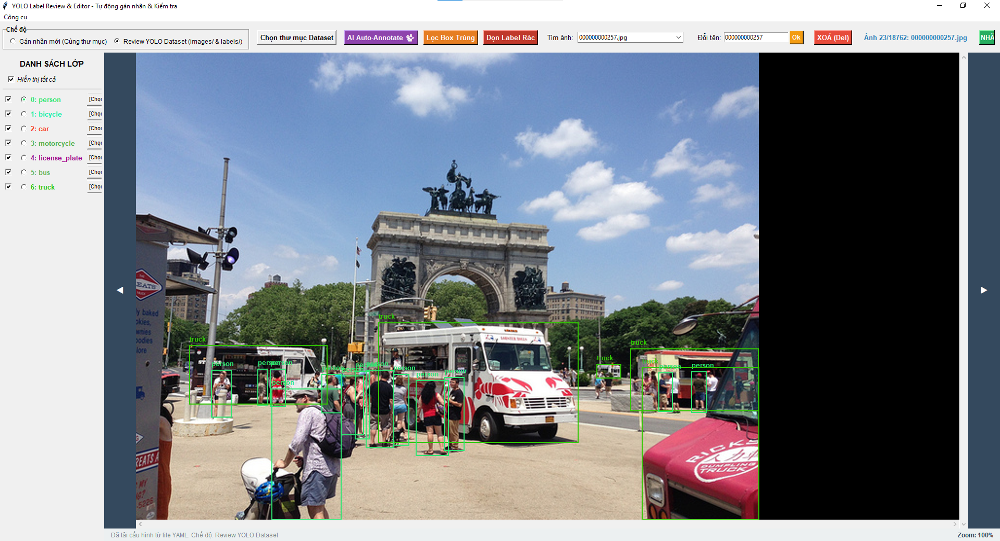
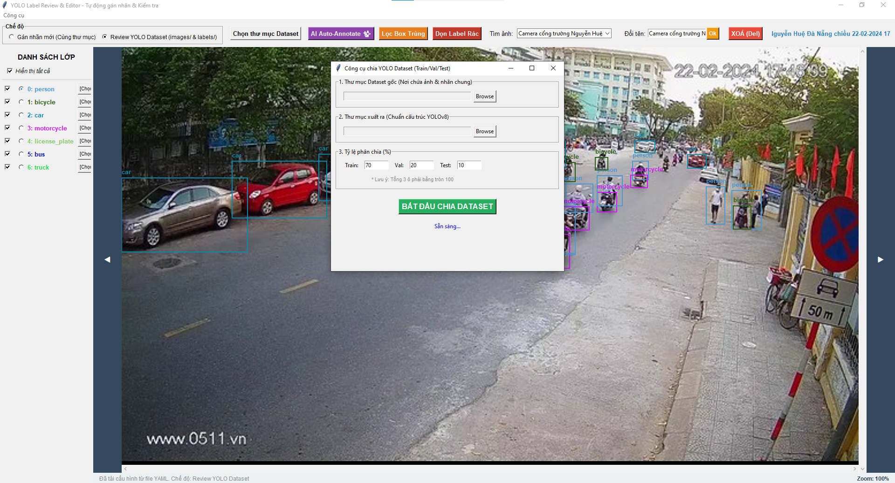
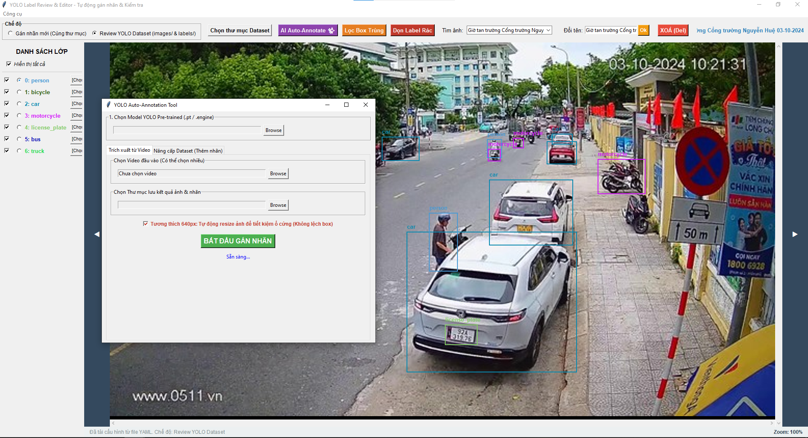

# 🏷️ Data Labeling Tool

Bộ công cụ hỗ trợ **gán nhãn dữ liệu YOLO** chuyên nghiệp — tự động trích xuất & gán nhãn từ video, đánh giá và chỉnh sửa nhãn thủ công trên giao diện trực quan, kèm đầy đủ công cụ quản lý dataset.

## 📸 Demo









## ✨ Tính năng

| Tính năng | Mô tả |
|---|---|
| 🤖 **Auto-Annotation** | Trích xuất frame từ video và dùng model YOLO (`.pt`) để gán nhãn tự động |
| 🗺️ **Class Mapping** | Quy đổi Class ID từ model pre-trained COCO sang dataset tuỳ chỉnh khi auto-annotate |
| 🔍 **Review & Edit** | Giao diện kéo-thả để vẽ, chỉnh sửa và xóa bounding box |
| 📂 **Dual-Mode** | Hỗ trợ cả thư mục đơn lẫn cấu trúc YOLO chuẩn (`images/` + `labels/`) |
| 🔎 **Tìm kiếm ảnh** | Ô tìm kiếm với gợi ý tự động (autocomplete) để nhảy nhanh đến ảnh bất kỳ |
| ✏️ **Đổi tên đồng bộ** | Đổi tên ảnh → tệp nhãn `.txt` tự động đổi theo |
| 💾 **Auto-Save** | Tự động lưu nhãn khi chuyển ảnh bằng phím mũi tên |
| 🧹 **Lọc Box Trùng** | Tự động xoá bounding box trùng lặp (IoU > 0.9) trên toàn dataset |
| 🗑️ **Dọn Label Rác** | Xoá file nhãn mồ côi không có ảnh đi kèm |
| ☑️ **Chọn đa nhãn** | Chọn tất cả nhãn cùng class, xoá/đổi class hàng loạt |

## 🛠️ Công cụ tích hợp (Menu → Công cụ)

| Công cụ | Mô tả |
|---|---|
| ✂️ **Chia Dataset** | Chia ảnh+nhãn thành `train/valid/test` theo tỉ lệ tuỳ chọn, tự sinh `data.yaml` |
| 📐 **Resize ảnh hàng loạt** | Resize toàn bộ ảnh về kích thước chuẩn (mặc định 640px), giảm dung lượng lưu trữ mà không lệch bounding box |
| 🔢 **Đổi Class ID hàng loạt** | Chuyển đổi Class ID trong file nhãn (VD: đổi class `0` → `4` cho dataset biển số) |
| 🔄 **Đồng bộ Ảnh ↔ Nhãn** | Quét và xoá file ảnh/nhãn không có cặp để cân bằng dataset 1-1 |

## 📂 Cấu trúc Dataset đầu ra

```
output_dataset/
├── data.yaml
├── train/
│   ├── images/
│   └── labels/
├── valid/
│   ├── images/
│   └── labels/
└── test/
    ├── images/
    └── labels/
```

## 🗂️ Cấu trúc dự án

```
DataLabelingTool/
├── main.py                ← Điểm khởi chạy ứng dụng
├── app.py                 ← Controller điều phối chính
├── auto_annotator.py      ← Tự động gán nhãn từ video + dataset có sẵn
│
├── core/                  ← Logic nghiệp vụ (không phụ thuộc giao diện)
│   ├── config.py          ← Cấu hình: CLASSES, COLORS, hằng số
│   └── data_manager.py    ← Quét thư mục, đọc/ghi/đổi tên nhãn
│
├── ui/                    ← Giao diện Tkinter
│   ├── toolbar.py         ← Thanh công cụ
│   ├── class_panel.py     ← Bảng chọn nhãn bên trái
│   ├── canvas_panel.py    ← Vùng vẽ trung tâm + điều hướng ◀ ▶
│   └── status_bar.py      ← Thanh trạng thái phía dưới
│
├── scripts/               ← Công cụ tiện ích (tích hợp vào Menu app)
│   ├── split_dataset.py   ← Chia train/valid/test
│   ├── resize_dataset.py  ← Resize ảnh hàng loạt
│   ├── reindex_license_plates.py  ← Đổi Class ID hàng loạt
│   └── cleanup_dataset.py ← Đồng bộ ảnh ↔ nhãn
│
└── assets/                ← Ảnh demo và tài nguyên
```

## 🚀 Cài đặt

### Yêu cầu
- Python 3.8+

### Cài đặt thư viện

```bash
pip install Pillow opencv-python ultralytics
```

## 📖 Hướng dẫn sử dụng

### Review & Chỉnh sửa nhãn

```bash
python main.py
```

1. Chọn **Chế độ** phù hợp với cấu trúc thư mục của bạn.
2. Nhấn **"Chọn thư mục Dataset"** để tải ảnh.
3. Kéo chuột trên ảnh để vẽ bounding box → nhấn **Enter** để chốt.
4. Nhấn `←`/`→` để chuyển ảnh (tự động lưu).

### Sử dụng Công cụ tiện ích

Truy cập từ menu **Công cụ** trên thanh menu của ứng dụng:
- **Chia Dataset** → Chọn thư mục nguồn, thư mục đích, tỉ lệ chia
- **Resize ảnh** → Chọn thư mục, resize về 640px
- **Đổi Class ID** → Chọn thư mục, nhập ID cũ và ID mới
- **Đồng bộ Ảnh ↔ Nhãn** → Chọn thư mục, xoá file không có cặp

## ⌨️ Phím tắt

| Phím | Chức năng |
|---|---|
| `Enter` | Chốt khung nhãn vừa vẽ |
| `Ctrl + Z` | Hoàn tác nhãn cuối cùng |
| `Ctrl + S` | Lưu nhãn thủ công |
| `Ctrl + R` | Trỏ vào ô đổi tên ảnh |
| `←` / `→` | Chuyển ảnh trước / sau (tự động lưu) |
| `Del` | Xoá nhãn đang chọn (hoặc xoá ảnh nếu không chọn nhãn) |
| `Esc` | Bỏ chọn nhãn |
| `Ctrl + Wheel` | Zoom in / Zoom out |

---

*Vibecode by thainv299 😁*
